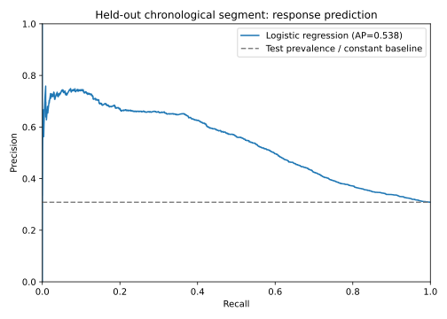

# Can pre-call data rank likely term-deposit responses?

A chronological, held-out classification analysis on the UCI Bank Marketing dataset. The question is whether information available before a marketing call can rank contacts by subsequent subscription outcome better than a constant-prevalence baseline. This is a retrospective research exercise, not a recommendation to contact particular people.

## Source

Moro, S., Rita, P., and Cortez, P. (2014), [Bank Marketing](https://archive.ics.uci.edu/dataset/222/bank+marketing), UCI Machine Learning Repository, DOI [10.24432/C5K306](https://doi.org/10.24432/C5K306). UCI lists [CC BY 4.0](https://creativecommons.org/licenses/by/4.0/). The script downloads the original archive, extracts `bank-additional-full.csv`, and records the outer ZIP's SHA-256. The source describes 41,188 rows ordered by date from May 2008 to November 2010, though individual dates and client IDs are absent. Raw data are not redistributed.

## Reproduce

Python 3.10+; from this folder:

```bash
python -m pip install -r requirements.txt
python model.py
python -m unittest discover -s tests -v
```

The download requires UCI access. Outputs are `outputs/results.json` and `outputs/precision_recall.svg`. The script checks schema, target labels, missing features, and basic count ranges. Fixed row-position splits allocate 64% for training, 16% for validation, 20% for a final later test. The three logistic-regression regularization values are selected by validation average precision. The chosen model is refit on the first 80%; the constant-prior DummyClassifier is fit to the same rows. Numeric variables are median-imputed and standardized; categorical variables are imputed and one-hot encoded. Preprocessing fits inside training pipelines. `duration` is excluded because it is only observed after a call; the model uses age, job, education, housing/loan status, contact channel and planned period, campaign history, and macro indicators. The dataset does not establish the exact point when all recorded fields were available, so this is a proposed pre-call feature set, not a verified production feature contract.

## Held-out results

The latest 8,238 rows had a **30.83%** positive rate. These figures were computed on that segment once after validation selection:

| Measure | Constant-prior baseline | Logistic regression |
| --- | ---: | ---: |
| Average precision | 0.3083 | 0.5383 |
| ROC AUC | 0.5000 | 0.7012 |
| Brier score (lower is better) | 0.2731 | 0.2170 |



Among the highest-scored 10% of test rows (824 calls), 547 were positive: **66.38% precision** and **21.54% recall**. This is a fixed review capacity, not a tuned probability cutoff or an estimate of extra subscriptions. The constant baseline cannot meaningfully rank tied scores. The first training segment had 4.79% positives, validation had 12.72%, and test had 30.83%; the shift shows why a random split would be misleading here. Refit model coefficients with the largest absolute values include calendar month and economic indicators, but correlated inputs and changing campaign conditions prevent causal interpretation.

## Limits and responsible use

The original records are from a Portuguese bank in 2008–2010. The absence of exact dates, customer IDs, and outreach costs blocks a customer-disjoint validation and any profit or intervention claim. The later segment's higher response prevalence materially affects average precision and calibration. Demographic fields may create disparate effects; no fairness evaluation was possible without an agreed group definition and use policy. Before any real use, verify feature availability at decision time, customer consent, legal constraints, calibration and subgroup behavior on recent customer-disjoint data, and compare against an operationally meaningful policy in a prospective test. The test scores here establish only retrospective discrimination on this dataset.
