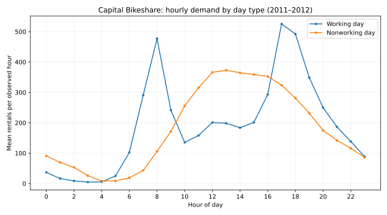

# When should a bike-share operator review capacity?

A reproducible SQL/Python descriptive analysis of hourly Capital Bikeshare demand in 2011–2012. The decision question is **which hours merit a closer staffing or bike rebalancing review on working versus nonworking days?** This is a system-wide demand profile, not a station-level dispatch plan.

## Source and license

Fanaee-T, H. and Gama, J. (2013), [Bike Sharing dataset](https://archive.ics.uci.edu/dataset/275/bike+sharing+dataset), UCI Machine Learning Repository, DOI [10.24432/C5W894](https://doi.org/10.24432/C5W894). UCI lists the dataset under [CC BY 4.0](https://creativecommons.org/licenses/by/4.0/). `pipeline.py` downloads the original ZIP from UCI and reads `hour.csv`; it records the retrieved archive's SHA-256. Data are aggregated hourly, with registered, casual, and total rentals; `workingday` is 1 on a day that is neither a weekend nor a holiday. The repository does not redistribute raw data.

## Reproduce

Python 3.10+ and `matplotlib` are required. From this folder:

```bash
python -m pip install -r requirements.txt
python pipeline.py
python -m unittest discover -s tests -v
```

Internet access to UCI is needed for a fresh run. `outputs/` contains the checked result of a run; the SQLite database is reproducibly generated and intentionally ignored by Git. The queries in `analysis.sql` group by day type and hour, calculate means over observed hourly records, and rank peak hours with a deterministic tie break. The chart and CSV exports are generated from those queries.

## Data checks and findings

The run represented in `outputs/` read **17,379** hourly rows spanning **731** dates from January 1, 2011 through December 31, 2012. Checks enforce the source column schema, unique observation IDs and date/hour pairs, valid hours and day type, nonnegative counts, and `casual + registered = cnt`. There are **165 absent date/hour combinations** against 24 hours on every observed date; they are reported, never filled with zero. The archive SHA-256 is recorded in `outputs/quality.json`.

| Day type | Highest mean hour | Mean rentals | Observed hours | Other high hours |
| --- | ---: | ---: | ---: | --- |
| Working day | 17:00 | 525.29 | 499 | 18:00, 08:00 |
| Nonworking day | 13:00 | 372.73 | 231 | 12:00, 14:00 |



**Decision:** review late afternoon and morning capacity on working days and midday capacity on nonworking days before allocating limited operations attention. This is a prioritization hypothesis, not proof that moving bikes or staffing these hours would improve service. No station IDs, bike availability, unmet demand, labor costs, or experimental outcomes are present.

## Limits

The data are historical and specific to Capital Bikeshare; the 2011–2012 pattern should not be presented as current demand. Means combine seasons and weather and are not causal estimates. The dataset aggregates rentals rather than trips by station. Missing hourly combinations can reflect data collection or zero-rental hours; their cause cannot be determined here. `registered` and `casual` are included for reconciliation and descriptive breakdown, not as independent sources of additional rentals. Future work would add station availability and evaluate a policy prospectively.
